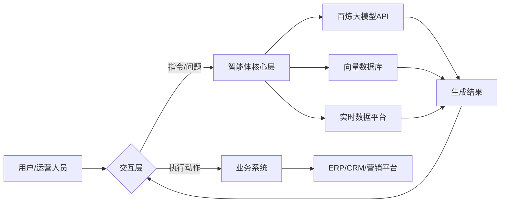

# 电商运营智能体

### **一、智能体定位与核心目标**

电商运营智能体需解决电商业务中的核心痛点，例如：

- **数据驱动决策**：实时分析市场趋势、用户行为、竞品动态。
- **自动化运营**：智能生成营销文案、客服应答、选品建议。
- **个性化服务**：基于用户画像提供精准推荐、定制化活动。
- **效率提升**：减少人工操作（如报表生成、活动配置），降低运营成本。

### **二、技术架构设计**

#### **1. 底层技术栈**

- **SpringAI**：用于集成大模型能力、管理智能体生命周期（如初始化、对话状态维护），支持 Spring Boot 快速开发。
- **阿里云百炼大模型**：提供自然语言处理（NLP）、图像生成、数据分析等基础能力（如调用百炼的电商行业模型）。
- **向量数据库**（如 Pinecone/FAISS）：存储电商领域知识（商品库、运营策略、用户历史数据），支持语义检索与快速匹配。
- **实时数据平台**（如 Flink + Kafka）：采集电商业务数据（订单、流量、用户行为），实时输入智能体。

#### **2. 智能体分层架构**

- **交互层**：提供 Web 界面、API 接口或集成至企业微信 / 钉钉，支持文本、语音、图片输入输出。
- 核心层
  - **意图解析**：通过百炼大模型识别用户需求（如 “生成 618 促销方案”“分析某商品退货率”）。
  - **知识检索**：从向量数据库中提取相关运营策略、历史案例、商品知识。
  - **逻辑推理**：结合实时数据（如库存、流量）生成决策，调用百炼模型完成内容生成或数据分析。
  - **工具调用**：对接电商业务系统（如订单系统、营销平台）执行操作（如创建活动、发送短信）。
- **业务系统集成**：通过 API 对接 ERP、CRM、广告投放平台等，实现 “分析 - 决策 - 执行” 闭环。

### **三、核心功能模块设计**

#### **1. 智能选品与供应链优化**

- 功能
  - 分析市场趋势（通过百炼大模型爬取电商平台 / 社交媒体数据），推荐潜力商品。
  - 结合库存周转率、毛利率等数据，生成补货建议或淘汰滞销品。
- 技术实现
  - 输入：历史销售数据、竞品价格、用户评论（通过实时数据平台获取）。
  - 处理：百炼大模型分析文本情感（如用户对某类商品的评价），向量数据库匹配成功选品案例。
  - 输出：选品清单、供应链优化策略（如建议采购量、供应商优先级）。

#### **2. 智能营销活动策划**

- 功能
  - 自动生成节日 / 大促活动方案（如双 11 玩法、会员日规则）。
  - 批量生成个性化营销文案（短信、海报文案、商品详情页描述）。
- 技术实现
  - 输入：活动主题、目标用户群体（运营人员指定）。
  - 处理：百炼大模型根据历史活动效果数据（存储于向量数据库）生成方案框架，调用图像生成模型（如百炼的文生图能力）制作海报。
  - 输出：可执行的活动计划、多版本营销素材。

#### **3. 智能客服与用户运营**

- 功能
  - 实时响应用户咨询（如物流查询、退换货政策），对接人工客服无缝转接。
  - 分析用户行为数据，自动触发运营动作（如向加购未付款用户发送优惠券）。
- 技术实现
  - 输入：用户聊天记录、浏览 / 购买行为数据。
  - 处理：百炼大模型进行意图分类（如咨询、投诉、建议），向量数据库检索标准答案库；结合用户画像（如消费能力、偏好品类）生成个性化触达策略。
  - 输出：客服回复内容、自动化运营任务（通过业务系统执行）。

#### **4. 数据报表与异常预警**

- 功能
  - 自动生成运营日报 / 周报（GMV、转化率、流量来源分析）。
  - 实时监控关键指标（如突发流量下跌、客单价异常），推送预警信息。
- 技术实现
  - 输入：实时业务数据（通过 Flink 清洗后存入数据库）。
  - 处理：百炼大模型解析数据趋势，对比历史阈值（存储于向量数据库）识别异常；生成自然语言版数据解读（如 “今日转化率环比下降 15%，可能因竞品促销导致”）。
  - 输出：可视化报表、预警通知（邮件 / 短信）。

### **四、开发流程与关键步骤**

#### **1. 领域知识准备**

- **数据收集**：整理电商业务数据（如历史活动方案、用户评论、商品信息），清洗后存入向量数据库，构建电商运营知识库。
- **Prompt 工程**：针对电商场景优化百炼大模型的提示词（如 “请以淘宝双 11 为例，生成包含满减、直播带货的促销方案”），提升响应准确性。

#### **2. 智能体开发与集成**

- 使用 SpringAI 搭建框架
  - 创建智能体类（`EcommerceAgent`），管理对话状态（如当前任务为 “生成营销文案” 时，存储活动主题、目标用户等上下文）。
  - 集成百炼 SDK，通过 `RestTemplate` 调用大模型接口，处理返回结果（如解析 JSON 格式的文案建议）。
- **工具调用适配**：开发业务系统适配器（如 `MarketingPlatformAdapter`），将智能体决策转换为 API 调用（如调用阿里云短信服务发送营销短信）。

#### **3. 测试与优化**

- **功能测试**：验证智能体在典型场景下的响应是否符合预期（如输入 “分析夏季女装销售趋势”，检查是否返回含数据图表和策略建议的报告）。
- 性能优化
  - 缓存高频查询结果（如常用商品知识库），减少百炼 API 调用延迟。
  - 异步处理耗时任务（如图像生成），避免阻塞用户交互。
- **用户反馈迭代**：收集运营人员使用反馈，优化提示词、知识库或算法逻辑。

### **五、落地与运营建议**

#### **1. 安全与合规**

- 数据加密：对用户隐私数据（如订单信息）进行脱敏处理，符合 GDPR/《个人信息保护法》。
- 权限控制：通过 Spring Security 实现角色管理（如区分运营人员、管理员的操作权限）。

#### **2. 商业化路径**

- **对内赋能**：先在企业内部运营团队试点，降低人工成本，提升决策效率。
- **对外服务**：将智能体能力封装为 SaaS 产品，向中小电商企业提供付费订阅（如按调用次数计费）。

#### **3. 持续迭代**

- 定期更新向量数据库中的行业知识（如引入新平台规则、新兴消费趋势）。
- 跟踪百炼大模型升级动态，及时接入新能力（如多模态生成、实时数据分析增强）。

### **六、技术难点与解决方案**

| **难点**             | **解决方案**                                                 |
| -------------------- | ------------------------------------------------------------ |
| 长对话上下文管理     | 使用 SpringAI 的状态管理机制，结合向量数据库存储对话历史的语义摘要 |
| 多工具调用协调       | 设计有限状态机（FSM）或使用工作流引擎（如 Camunda）管理工具调用顺序 |
| 大模型输出可控性     | 通过 Prompt 模板化（如指定输出格式为 JSON/Markdown）和结果校验逻辑实现 |
| 实时数据与模型的融合 | 采用流式处理框架（如 Flink）预处理实时数据，通过提示词注入模型输入 |

通过以上思路，可构建一个集 “数据洞察 - 智能决策 - 自动化执行” 于一体的电商运营智能体，帮助企业提升运营效率并降低对人工经验的依赖。实际开发中需结合业务规模逐步扩展功能，优先落地高频、高价值场景（如智能客服、营销文案生成）。